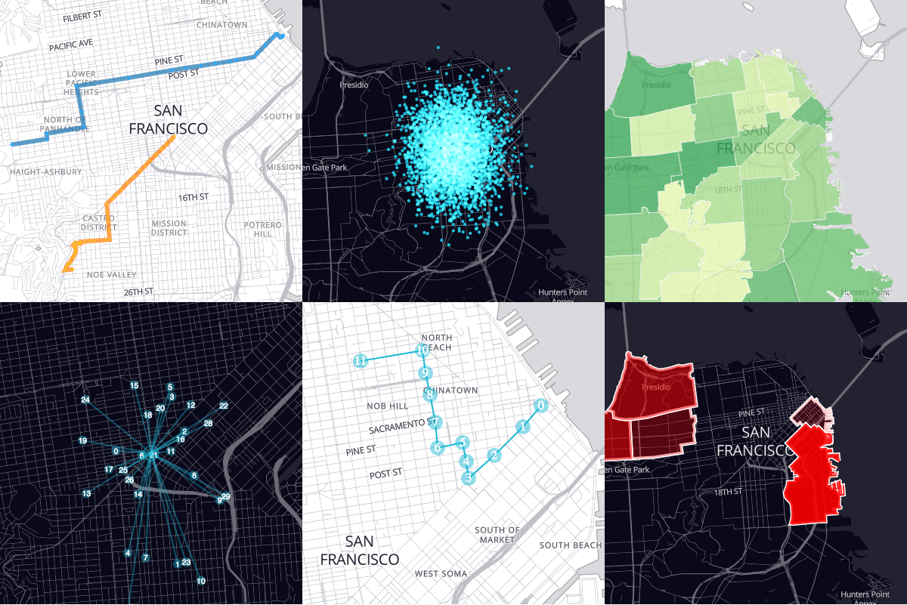

# react-map-gl

react-map-gl provides a [React](http://facebook.github.io/react/) friendly
API wrapper around [Mapbox GL JS](https://www.mapbox.com/mapbox-gl-js/). A webGL
based vector tile mapping library.

WARNING: This project is still very new and the API may change. There also may
be Mapbox APIs that haven't yet been exposed.



## Overview

react-map-gl provides an `overlay` API so you can add visualization overlays.

Supported Overlays:

1. ChoroplethOverlay
2. ScatterplotOverlay
3. DraggablePointsOverlay
4. SVGOverlay
5. CanvasOverlay

## Installation

```
npm install react-map-gl --save
```

## Usage

````js
<MapGL width={400} height={400} latitude={37.7577} longitude={-122.4376}
  zoom={8} onChangeViewport={function(opts) {
    // opts = {latitude, longitude, zoom, bbox}
  }}
/>
````

### Using overlays

````js
<MapGL {...mapProps}>
  <ScatterplotOverlay locations={locations} dotRadius={4} globalOpacity={1}
    compositeOperation="screen" />
  // Add additional overlays here...
])
````


### ImmutableJS all the things

The `mapStyle` property of the `MapGL` as well as several of the built in
overlay properties must be provided as
[ImmutableJS](https://facebook.github.io/immutable-js/) objects. This allows
the library to be fast since computing changes to props only involves checking
if the immutable objects are the same instance.


## Development

To develop on this component, install the dependencies and then build and watch
the static files.

```bash
$ npm install
```

To serve example app:

```bash
$ npm start &
$ open "http://localhost:9966/?access_token="`echo $MapboxAccessToken`
```

Where `echo $MapboxAccessToken` returns your Mapbox access token.

Once complete, you can view the component in your browser at
[localhost:9966](http://localhost:9966). Any changes you make will automatically
run the compiler to build the files again.

## Disclaimer

This project is not affiliated with either Facebook or Mapbox.

## Example Data

1. SF GeoJSON data from: [SF OpenData](http://data.sfgov.org).
